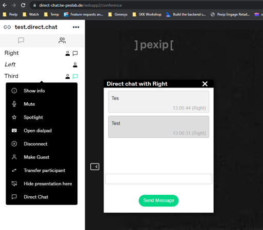
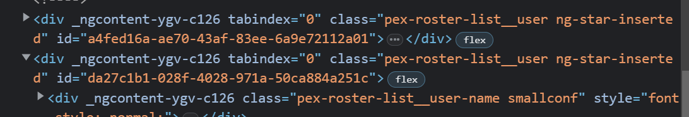

# Direct Chat Plugin for webapp2

**Supports Pexip Infinity V31 and later**

Allows to send direct chat messages to a specific participant.
The messages will only be received by the selected participant. Other participants do not get the messages. 
A direct messages conversation is indicated by an envelope icon next to the display names in the participant list.
New messages are indicated by a green envelope.
A chat window can be opened through the participant context menu in the participant list. 
Each participant is associated with a separate chat window. It is possible to open multiple chat windows at the same time. The chat window title contains the receiving participant name.

## Goal
Support „direct chat“ via webapp2 plugin 

Features:
- Chat window for sending and receiving direct messages
- Entry in participant context menu in  participant list to open chat window
- Message indicator in participant list

## Solution
Added participant uuid to dom tree
(participant entries) to set the message
indicator depending on sender uuid.

The plugin uses the Pexip Infinity direct message api:

api/client/v2/conferences/test.direct.chat/participants/{UUD}/message
{"type":"text/plain","payload":"Test"}

Used library [JSFrame](https://github.com/riversun/JSFrame.js) (MIT License)

## Limitations
- Group chats are not supported
- Does not scale properly on mobile and small window sizes

